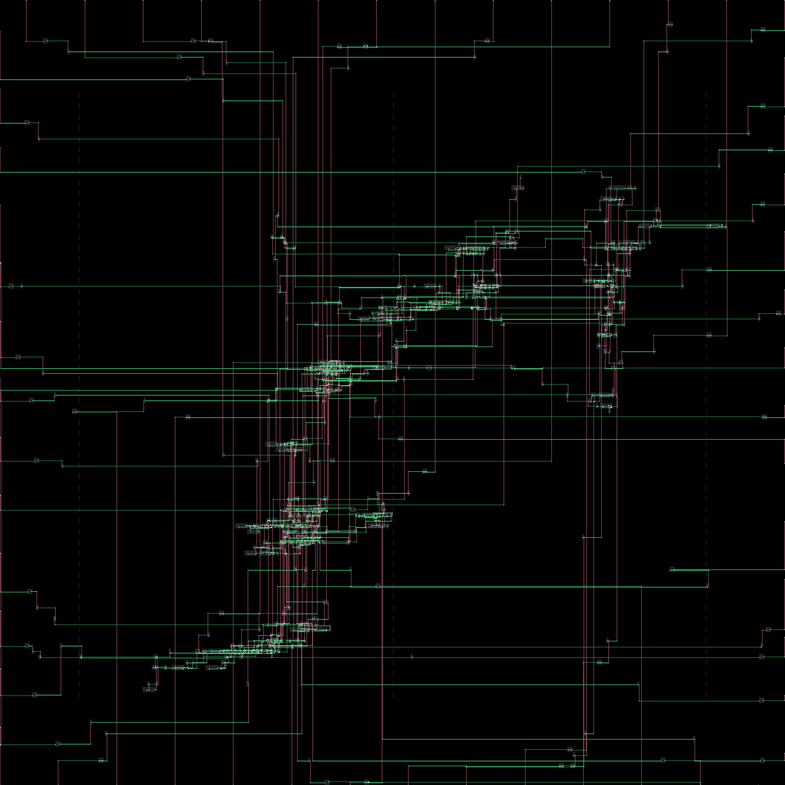

# Rust Physical Design Flow

A simplified, educational physical design toolchain for digital integrated circuits, built from scratch in Rust. This project explores the implementation of analytical placement algorithms and congestion-aware routing on synthetic benchmarks.



## Project Scope & Limitations

This is a **portfolio project** designed to demonstrate complex algorithmic implementation in systems programming.
*   **Target:** Synthetic benchmarks (Random logic, Bookshelf format) and small digital blocks.
*   **Not Supported:** Timing analysis, clock tree synthesis, antenna rule checks, or GDSII export.
*   **Status:** Functional on designs up to ~10k nets.

## Key Features

### 1. Analytical Global Placement
Implements a non-linear optimization solver to distribute standard cells.
*   **Density Model:** Solves Poisson's equation using **FFT (Fast Fourier Transform)** to model cell density as an electrostatic field.
*   **Wirelength:** Minimizes Weighted Average (WA) wirelength using **Nesterov's Accelerated Gradient Descent**.

### 2. Legalization
*   **Abacus Algorithm:** Moves cells to legal manufacturing grid locations while preserving the global placement order and minimizing displacement.

### 3. Detailed Routing
*   **Pathfinder Algorithm:** A negotiation-based router that allows temporary congestion and iteratively resolves conflicts.
*   **A* Search:** Multithreaded 3D maze routing to connect pins across multiple metal layers.

## Performance

| Benchmark | Size | Status | Notes |
| :--- | :--- | :--- | :--- |
| **Random** | 1k - 2k Nets | Functional | Converges quickly (<30s). |
| **Random** | 5k+ Nets | Experimental | Routing may require high iteration counts. |
| **GCD** | ~500 Nets | Functional | Successfully routes standard cell logic. |

## Usage

### Prerequisites
*   Rust (latest stable)

### Running a Demo
Generate a random netlist with 50% utilization and run the full flow:

```bash
# Generate a benchmark with 2000 cells and 50% density
cargo run --release -p eda-cli -- generate --cells 2000 --nets 2000 --utilization 0.5

# Run Placement and Routing
cargo run --release -p eda-cli -- flow
```
