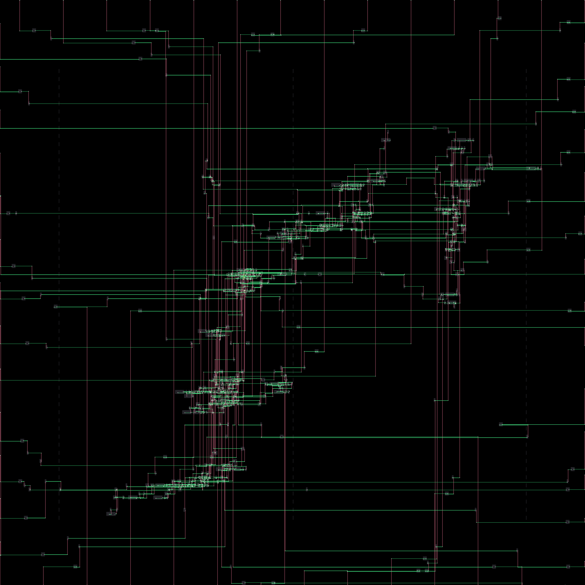
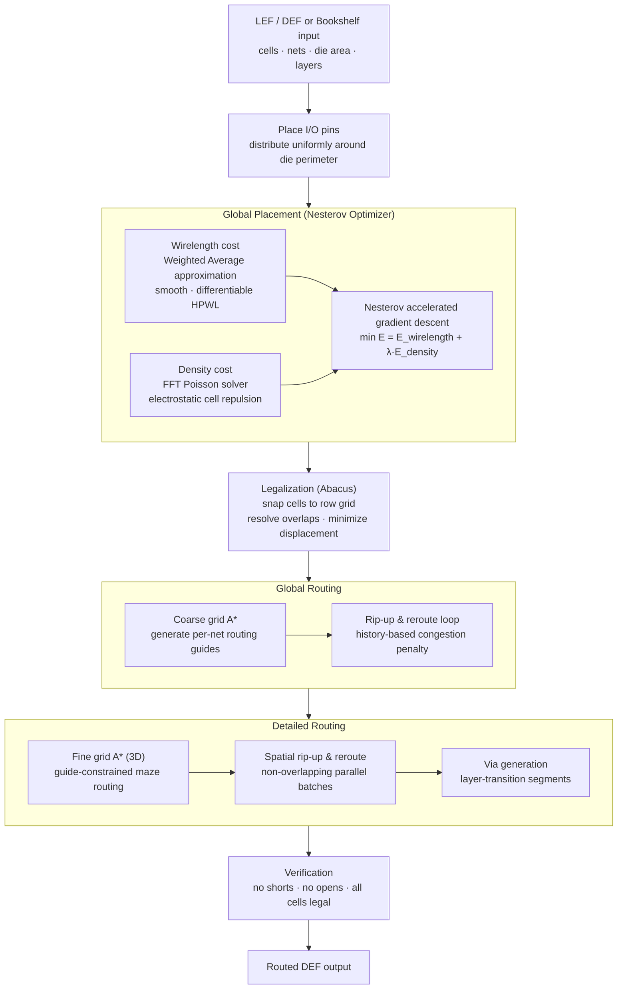

# VLSI Physical Design Tool

A digital IC placement and routing engine written in Rust. Implements the full physical design flow — analytical global placement, Abacus legalization, and two-stage negotiation-based routing — from scratch, targeting synthetic benchmarks up to ~10k nets.

| GCD (~500 nets) | 5k Synthetic |
|:---:|:---:|
|  |  |

*Left: GCD block, a real standard-cell design. Right: randomly generated synthetic netlist — uniform fanout, no critical paths — used to stress-test routing at scale.*

---

## Full Design Flow


```mermaid
flowchart TD
    INPUT["LEF / DEF or Bookshelf input<br/>cells · nets · die area · layers"]
    IO["Place I/O pins<br/>distribute uniformly around die perimeter"]

    subgraph GP["Global Placement (Nesterov Optimizer)"]
        WL["Wirelength cost<br/>Weighted Average approximation<br/>smooth · differentiable HPWL"]
        DENS["Density cost<br/>FFT Poisson solver<br/>electrostatic cell repulsion"]
        OPT["Nesterov accelerated gradient descent<br/>min E = E_wirelength + λ·E_density"]
    end

    LEG["Legalization (Abacus)<br/>snap cells to row grid<br/>resolve overlaps · minimize displacement"]

    subgraph GR["Global Routing"]
        GRA["Coarse grid A*<br/>generate per-net routing guides"]
        GRR["Rip-up & reroute loop<br/>history-based congestion penalty"]
    end

    subgraph DR["Detailed Routing"]
        DRA["Fine grid A* (3D)<br/>guide-constrained maze routing"]
        DRR["Spatial rip-up & reroute<br/>non-overlapping parallel batches"]
        VIA["Via generation<br/>layer-transition segments"]
    end

    VER["Verification<br/>no shorts · no opens · all cells legal"]
    OUT["Routed DEF output"]

    INPUT --> IO --> GP --> LEG --> GR --> DR --> VER --> OUT
    WL & DENS --> OPT
    GRA --> GRR
    DRA --> DRR --> VIA
```

---

## Placement: FFT-Accelerated Electrostatics

Global placement minimizes two competing objectives simultaneously:

**Wirelength** uses the Weighted Average (WA) smooth approximation of half-perimeter wirelength — differentiable everywhere, enabling gradient-based optimization. Per-net weights prioritize critical paths.

**Density** is modeled as an electrostatic field: cells act as electric charges that repel each other when they overlap. The density distribution is gridded into an N×N bin map, then the Poisson equation is solved in frequency domain via FFT in O(N log N) — versus O(N²) for direct methods. The resulting repulsive force gradient pushes cells out of congested regions.

**Nesterov's accelerated gradient descent** drives the iteration. Compared to vanilla gradient descent, the momentum term (aₖ = (1 + √(1 + 4aₖ₋₁²)) / 2) provides faster convergence on smooth near-convex problems like placement.

---

## Legalization: Abacus Algorithm

After global placement, cells can overlap. The Abacus algorithm legalizes them:

1. **Identify rows** — find the standard cell row height; divide die into rows, splitting at fixed macros
2. **Assign cells to rows** — by their global placement Y coordinate; overflow spills to adjacent rows
3. **Cluster within rows** — group cells into clusters and compute optimal cluster X position as a weighted centroid
4. **Pack clusters** — place sequentially along the row; adaptive padding (scales with utilization) prevents row overflow

Displacement from global placement is minimized throughout — the Abacus cost function explicitly penalizes large moves.

---

## Routing: Pathfinder with 3D A*

Routing runs in two stages:

**Global routing** operates on a coarse grid (~100×100 gcells). A* finds paths for all nets in parallel, then a Rip-up-and-Reroute loop resolves congestion. History costs accumulate on overloaded edges, steering later iterations away from hot spots (the Pathfinder algorithm).

**Detailed routing** operates on the fine routing grid (track pitch resolution). Each net is routed with guide-constrained A* — the search is restricted to gcells assigned by global routing, dramatically pruning the search space. Spatial batching enables parallel rerouting: non-overlapping congested nets are rerouted simultaneously each iteration. Via costs penalize layer transitions, encouraging planar routes where possible.

---

## Data Representation

The `NetlistDB` is the central data structure shared across all tools:

```
NetlistDB
├── cells: Vec<CellData>          # instances with dimensions, fixed flag, pin list
├── nets: Vec<NetData>            # connectivity + routed segments after routing
├── positions: Vec<Point<f64>>   # mutable cell positions (updated by placer)
├── layers: Vec<LayerData>        # metal layer stack (direction, pitch, width)
├── die_area: Rect                # chip boundary
└── tracks: Vec<TrackDef>         # routing grid definitions
```

Type-safe index newtypes (`CellId`, `NetId`, `PinId`) prevent accidental index confusion at compile time with zero runtime overhead (`repr(transparent)` u32 wrappers).

---

## Performance

| Benchmark | Nets | Status | Notes |
|---|---|---|---|
| GCD block | ~500 | Fully routed | Standard cell logic, verified routable end-to-end |
| Random synthetic | 1k–2k | Placement converges | Routing may not fully resolve congestion |
| IBM01 and above | 12k+ | Not supported | Global routing congestion resolution breaks down at this scale |

---

## Usage

**Requirements:** Rust stable

```bash
# Generate a random benchmark (2000 cells, 50% density) and run the full flow
cargo run --release -p eda-cli -- generate --cells 2000 --nets 2000 --utilization 0.5
cargo run --release -p eda-cli -- flow

# Run on a Bookshelf benchmark
cargo run --release -p eda-cli -- flow --input benchmarks/gcd
```

Output images (`nesterov_placer.png`, `placed.png`, `gr_initial_congestion.png`, `routed.png`) are written to the working directory after each stage.
