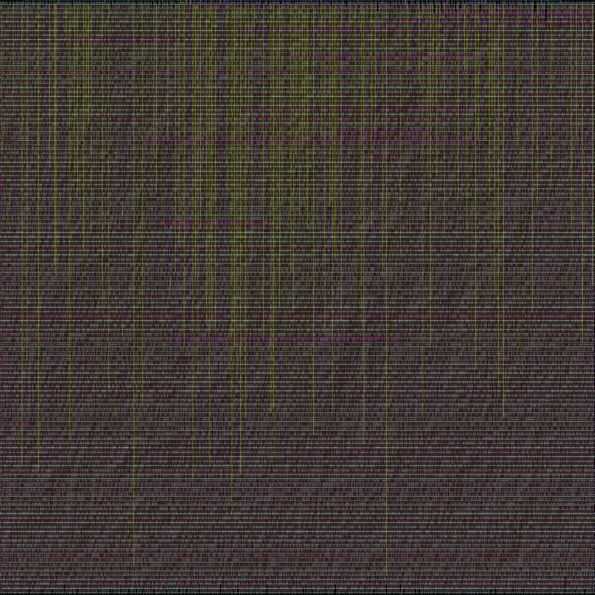
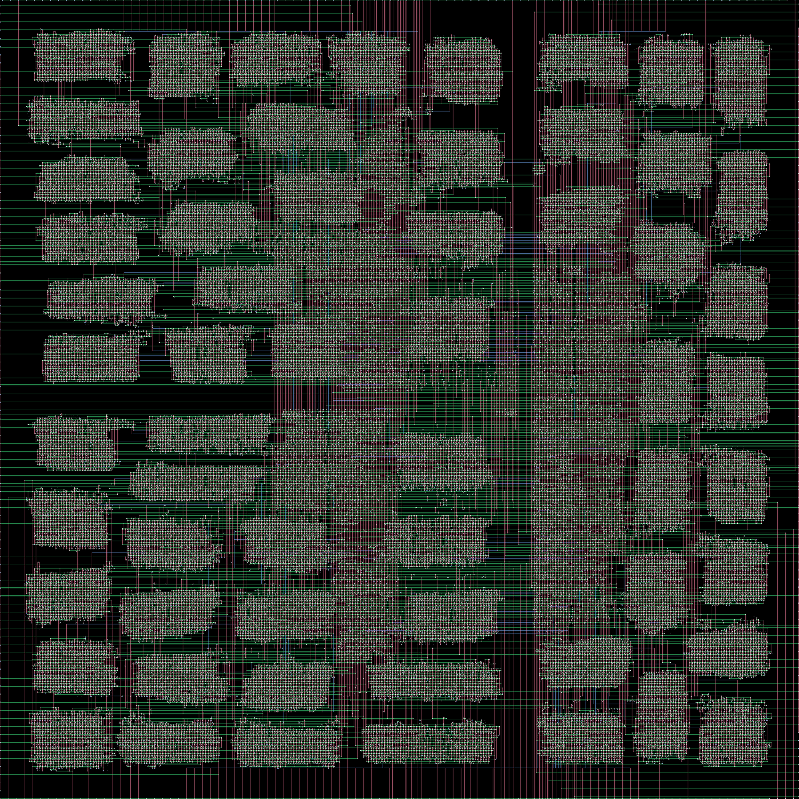
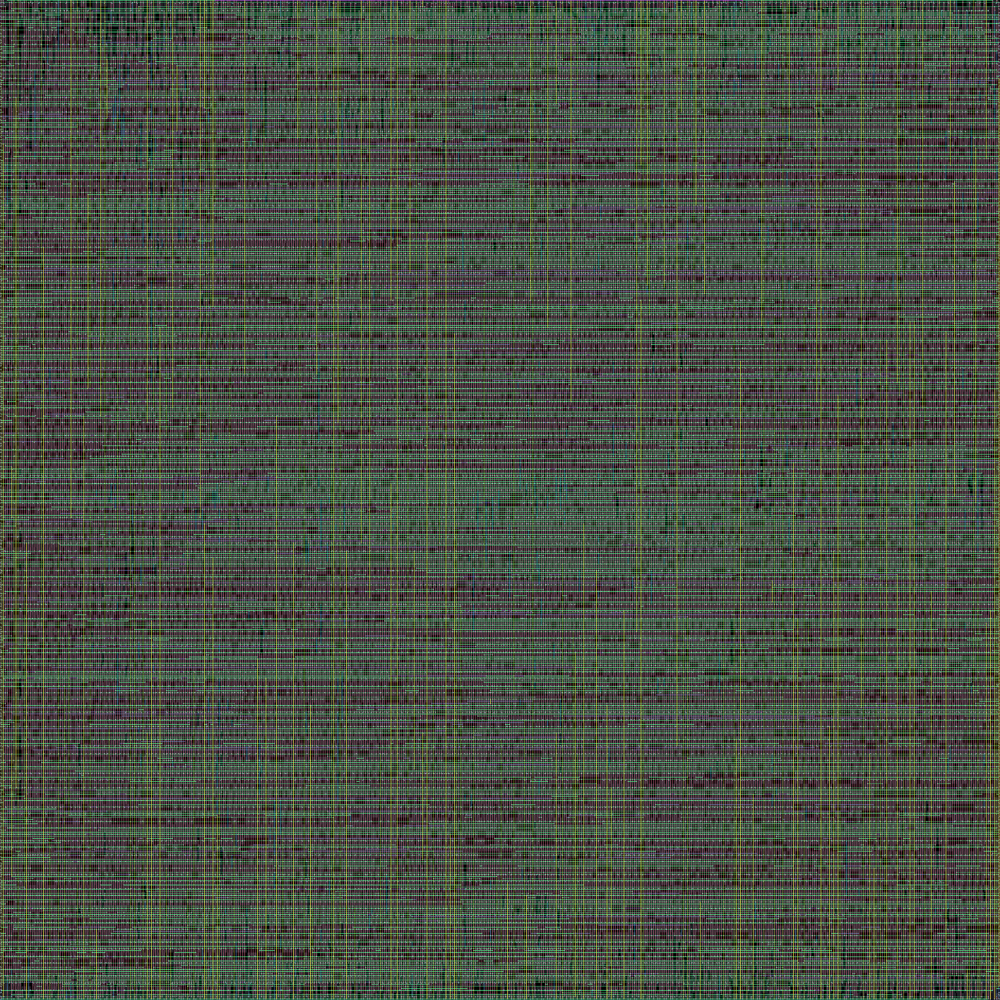
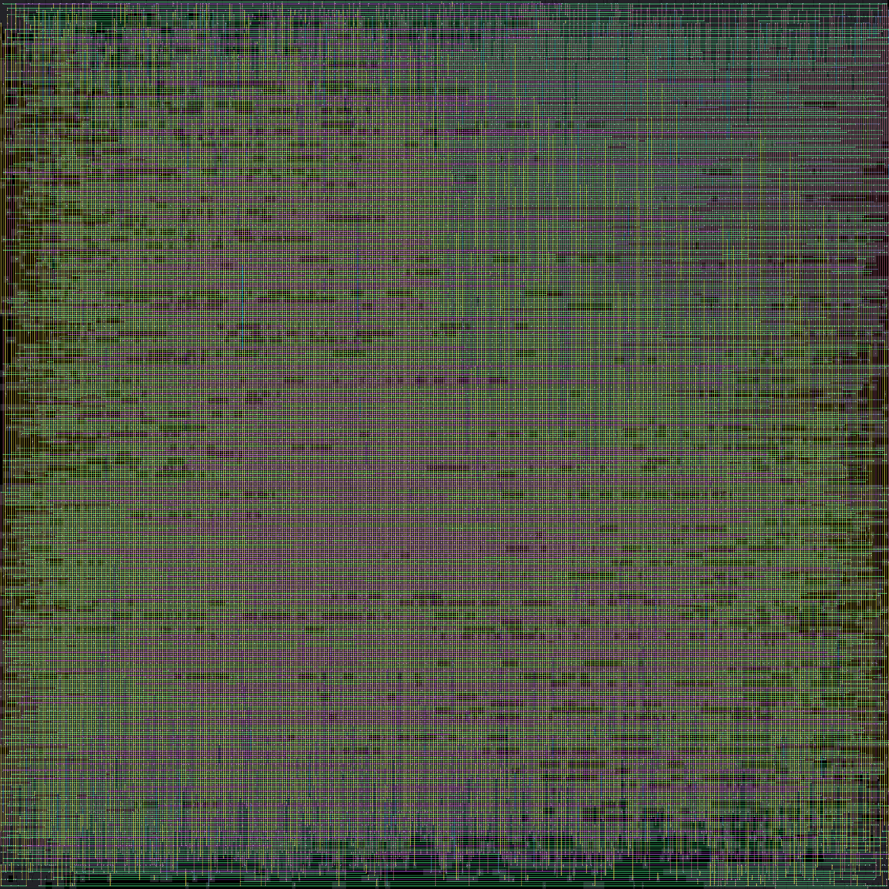
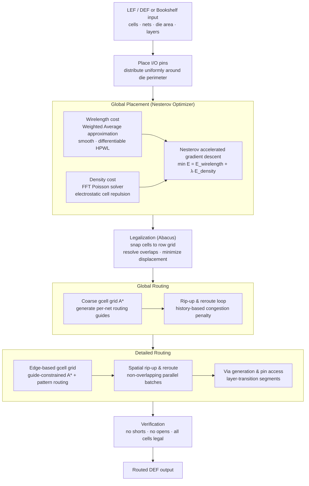

# PARE — Placement And Routing Engine

A digital IC placement and routing engine written in Rust. Implements the full physical design flow — analytical global placement, Abacus legalization, and two-stage negotiation-based routing — from scratch. Successfully places and routes real benchmarks up to 67k cells / 64k nets with zero DRC violations.

| IBM10 (64,227 nets) | AES (51,671 nets) |
|:---:|:---:|
|  |  |

| IBM05 (28,446 nets) | IBM01 (11,507 nets) |
|:---:|:---:|
|  |  |

*Top: IBM10 ISPD benchmark (67k cells, 49% utilization) and AES cipher (Nangate45, 10 metal layers). Bottom: IBM05 (80% utilization) and IBM01. All verified DRC-clean — no shorts, no opens.*

---

## Full Design Flow


```mermaid
flowchart TD
    INPUT["LEF / DEF or Bookshelf input<br/>cells · nets · die area · layers"]
    IO["Place I/O pins<br/>distribute uniformly around die perimeter"]

    subgraph GP["Global Placement (Nesterov Optimizer)"]
        WL["Wirelength cost<br/>Weighted Average approximation<br/>smooth · differentiable HPWL"]
        DENS["Density cost<br/>FFT Poisson solver<br/>electrostatic cell repulsion"]
        OPT["Nesterov accelerated gradient descent<br/>min E = E_wirelength + λ·E_density"]
    end

    LEG["Legalization (Abacus)<br/>snap cells to row grid<br/>resolve overlaps · minimize displacement"]

    subgraph GR["Global Routing"]
        GRA["Coarse gcell grid A*<br/>generate per-net routing guides"]
        GRR["Rip-up & reroute loop<br/>history-based congestion penalty"]
    end

    subgraph DR["Detailed Routing"]
        DRA["Edge-based gcell grid<br/>guide-constrained A* + pattern routing"]
        DRR["Spatial rip-up & reroute<br/>non-overlapping parallel batches"]
        VIA["Via generation & pin access<br/>layer-transition segments"]
    end

    VER["Verification<br/>no shorts · no opens · all cells legal"]
    OUT["Routed DEF output"]

    INPUT --> IO --> GP --> LEG --> GR --> DR --> VER --> OUT
    WL & DENS --> OPT
    GRA --> GRR
    DRA --> DRR --> VIA
```

---

## Placement: FFT-Accelerated Electrostatics

Global placement minimizes two competing objectives simultaneously:

**Wirelength** uses the Weighted Average (WA) smooth approximation of half-perimeter wirelength — differentiable everywhere, enabling gradient-based optimization. Per-net weights prioritize critical paths.

**Density** is modeled as an electrostatic field: cells act as electric charges that repel each other when they overlap. The density distribution is gridded into an N×N bin map, then the Poisson equation is solved in frequency domain via FFT in O(N log N) — versus O(N²) for direct methods. The resulting repulsive force gradient pushes cells out of congested regions.

**Nesterov's accelerated gradient descent** drives the iteration. Compared to vanilla gradient descent, the momentum term (aₖ = (1 + √(1 + 4aₖ₋₁²)) / 2) provides faster convergence on smooth near-convex problems like placement.

---

## Legalization: Abacus Algorithm

After global placement, cells can overlap. The Abacus algorithm legalizes them:

1. **Identify rows** — find the standard cell row height; divide die into rows, splitting at fixed macros
2. **Assign cells to rows** — by their global placement Y coordinate; overflow spills to adjacent rows
3. **Cluster within rows** — group cells into clusters and compute optimal cluster X position as a weighted centroid
4. **Pack clusters** — place sequentially along the row; adaptive padding (scales with utilization) prevents row overflow

Displacement from global placement is minimized throughout — the Abacus cost function explicitly penalizes large moves.

---

## Routing: Two-Stage Pathfinder on GCell Grid

Routing runs in two stages on an edge-based gcell grid where capacity is structurally tied to the metal layer stack. Direction is enforced by the grid itself — horizontal layers only have horizontal edge capacity, vertical layers only have vertical. Capacities are auto-computed from track pitch and gcell size.

**Global routing** operates on a coarse grid (~50×50 gcells). A* finds paths for all nets, then a Rip-up-and-Reroute loop resolves congestion. History costs accumulate on overloaded edges, steering later iterations away from hot spots (the Pathfinder algorithm).

**Detailed routing** operates on a finer gcell grid (auto-scaled to ~400×400 for large designs). Each net is first attempted with pattern routing (L-shaped and Z-shaped routes that check edge capacity), falling back to guide-constrained A* for complex paths. Spatial batching enables parallel rerouting: non-overlapping congested nets are rerouted simultaneously each iteration.

**Segment generation** converts gcell paths to physical wire segments. Pin access uses L-shaped Manhattan M1 wires with via stacks, and gcell-center routing guarantees consistent via positions across layer transitions.

---

## Data Representation

The `NetlistDB` is the central data structure shared across all tools:

```
NetlistDB
├── cells: Vec<CellData>          # instances with dimensions, fixed flag, pin list
├── nets: Vec<NetData>            # connectivity + routed segments after routing
├── positions: Vec<Point<f64>>   # mutable cell positions (updated by placer)
├── layers: Vec<LayerData>        # metal layer stack (direction, pitch, width)
├── die_area: Rect                # chip boundary
└── tracks: Vec<TrackDef>         # routing grid definitions
```

Type-safe index newtypes (`CellId`, `NetId`, `PinId`) prevent accidental index confusion at compile time with zero runtime overhead (`repr(transparent)` u32 wrappers).

---

## Performance

| Benchmark | Cells | Nets | Utilization | Layers | Result |
|---|---|---|---|---|---|
| GCD | 579 | 579 | 27% | 10 (Nangate45) | DRC-clean |
| IBM01 | 12,506 | 11,507 | 85% | 6 (Bookshelf) | DRC-clean |
| IBM05 | 28,146 | 28,446 | 80% | 6 (Bookshelf) | DRC-clean |
| AES | 20,533 | 51,671 | 5% | 10 (Nangate45) | DRC-clean |
| IBM10 | 67,692 | 64,227 | 49% | 6 (Bookshelf) | DRC-clean |

All benchmarks are real circuits (ISPD or open-source RTL), not synthetic. IBM10 is the largest — 67k cells with 64k nets. IBM05 runs at 80% utilization with complex multi-pin nets. AES uses a real technology library (Nangate45) with 10 metal layers at realistic pitches.

---

## Usage

**Requirements:** Rust stable

```bash
# Run the full flow on the GCD benchmark (LEF/DEF)
cargo run --release -- --config configs/config_gcd.toml

# Run on IBM01, IBM05, or IBM10 (Bookshelf format)
cargo run --release -- --config configs/config_ibm01.toml
cargo run --release -- --config configs/config_ibm05.toml
cargo run --release -- --config configs/config_ibm10.toml

# Run on AES (LEF/DEF, Nangate45, 51k nets)
cargo run --release -- --config configs/config_aes.toml

# Route only (skip placement, uses previously placed DEF)
cargo run --release -- --config configs/config_gcd.toml route
```

Output images (`nesterov_placer.png`, `placed.png`, `routed.png`) and the routed DEF are written to the `output/` directory.
